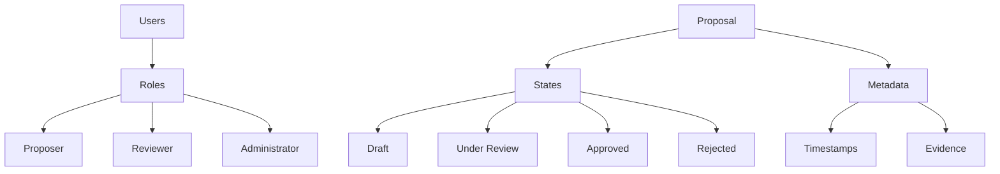

# Proposer Shield

A decentralized smart contract platform for secure, transparent, and verifiable proposal management using blockchain technology.

## Overview

Proposer Shield provides a robust framework for creating, tracking, and managing proposals with advanced access control, verification mechanisms, and immutable record-keeping. The platform enables organizations to streamline their proposal workflows while maintaining transparency and security.

### Key Features
- Decentralized proposal creation and tracking
- Granular access control and role-based permissions
- Immutable proposal records
- Multi-stakeholder collaboration
- Comprehensive proposal lifecycle management
- Flexible verification and approval processes

## Architecture

Proposer Shield is built around a core smart contract that manages users, proposals, and their associated states and transitions.



### Core Components
- **Users**: Multiple roles with distinct permissions
- **Proposals**: Individual proposal entities
- **States**: Proposal lifecycle stages
- **Metadata**: Comprehensive proposal information
- **Verification**: Structured approval mechanisms

## Contract Documentation

### proposer-shield.clar
The main contract managing the Proposer Shield platform's functionality.

#### Key Maps
- `users`: User information and roles
- `proposals`: Proposal definitions and states
- `proposal-reviews`: Review and verification records
- `user-permissions`: Access control mappings

#### Access Control
- Role-based permissions
- Granular review and approval workflows
- Immutable state transitions

## Getting Started

### Prerequisites
- Clarinet
- Stacks blockchain wallet
- Development environment for Clarity

### Basic Usage

1. Register a user:
```clarity
(contract-call? .proposer-shield register-user "Jane Doe" u2) ;; Register as reviewer
```

2. Create a proposal:
```clarity
(contract-call? .proposer-shield create-proposal 
    "Infrastructure Upgrade" 
    "Comprehensive network infrastructure improvement plan" 
    "Technology" 
    u1)
```

3. Review a proposal:
```clarity
(contract-call? .proposer-shield review-proposal u1 true "Approved with comments")
```

## Function Reference

### User Management
```clarity
(register-user (name (string-ascii 100)) (role uint))
(update-user-permissions (user-id principal) (permissions (list uint)))
```

### Proposal Management
```clarity
(create-proposal 
    (title (string-ascii 100)) 
    (description (string-ascii 500))
    (category (string-ascii 50))
    (priority uint))

(update-proposal-state 
    (proposal-id uint) 
    (new-state uint))

(review-proposal 
    (proposal-id uint) 
    (approval bool) 
    (comments (optional (string-utf8 500))))
```

## Development

### Testing
1. Clone the repository
2. Install Clarinet
3. Run `clarinet test`
4. Use `clarinet console` for interactive testing

### Local Development
1. Set up local Clarinet chain
2. Deploy contracts
3. Interact through console or API

## Security Considerations

### Permissions and Access Control
- Strict role-based access control
- Immutable proposal state transitions
- Transparent review processes
- Comprehensive audit trails

### Known Limitations
- Proposal states are sequentially defined
- External evidence must be referenced
- Initial roles are predefined

### Best Practices
- Carefully manage user roles
- Provide detailed proposal metadata
- Implement thorough review processes
- Maintain clear communication channels